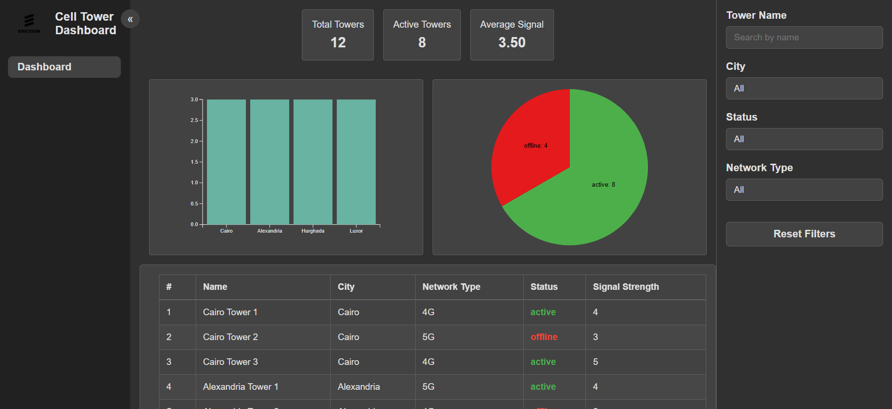
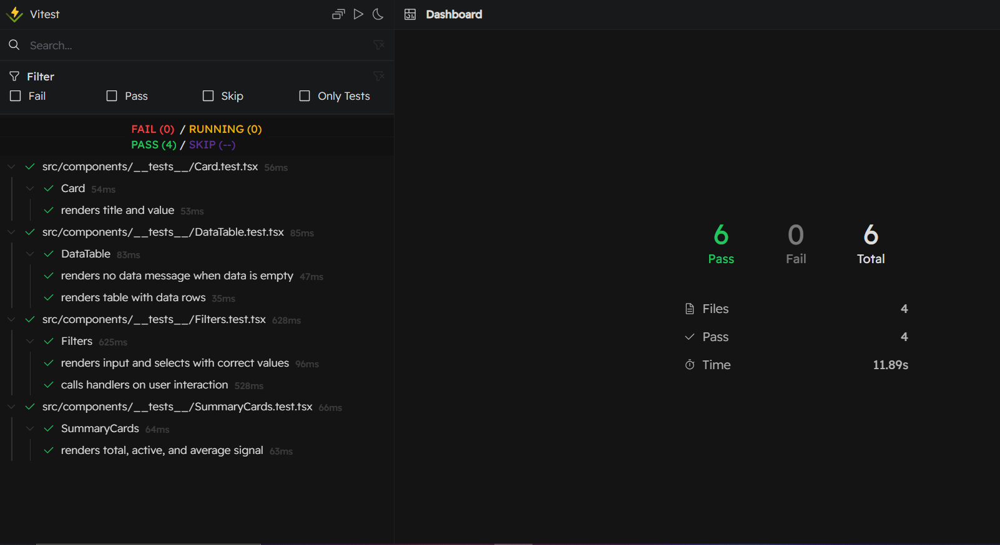

# 📡 Cell Tower Dashboard

A responsive web dashboard to help a telecom operations team monitor and analyze the status of cell towers across different cities.

## 🚀 Live Demo

🔗 [View Live Application](https://ericsson-task-madkooours-projects.vercel.app/)

## 📝 Project Overview

This project is part of a frontend engineering assessment. It showcases skills in **React**, **TypeScript**, **SASS**, and **D3.js**, focused on building a real-time dashboard to display and filter mock data of telecom cell towers.

---

## 🧰 Tech Stack

- ⚛️ React (Functional Components + Hooks)
- 🔠 TypeScript (Typed interfaces and logic)
- 🎨 SCSS (Custom variables, responsiveness)
- 📊 D3.js (Bar and Pie Charts)

---

## 📋 Features

- ✅ Summary cards showing total towers, active towers, and average signal strength
- 🔍 Search and filter functionality for tower name and city
- 📊 **D3.js** charts:
  - Bar chart: Tower count per city
  - Pie chart: Active vs Offline status
- 📄 Data table displaying detailed tower info
- 📱 Fully responsive design (mobile + desktop)

---

## 🧪 Bonus Features

- ✅ Loading states during chart rendering
- ✅ Unit tests for core components using Vitest
- ✅ Clean, modular code structure
- 🧠 Considered trade-offs between performance and simplicity

---

## 📦 Installation & Running Locally

```bash
# 1. Clone the repository
git clone https://github.com/MadkoOour/ericsson-task

# 2. Install dependencies
yarn install

# 3. Run the development server
yarn dev
```


## ✨ Screenshots

| Summary + Filters | Charts + Table |


| Test |


---

## 👏 Thanks

Thanks for reviewing the project. Please feel free to reach out for any clarifications or discussions.